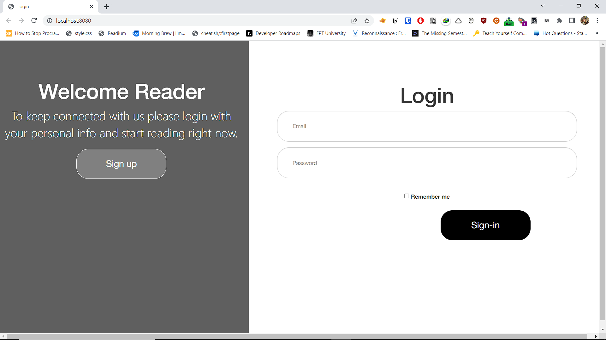
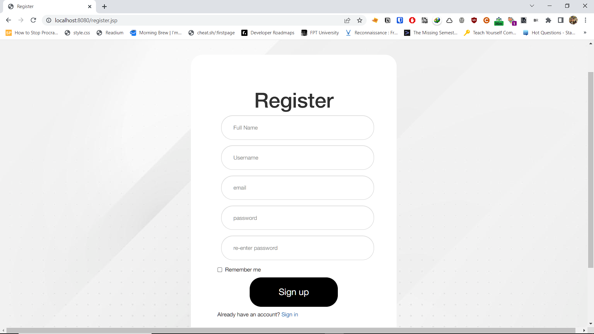
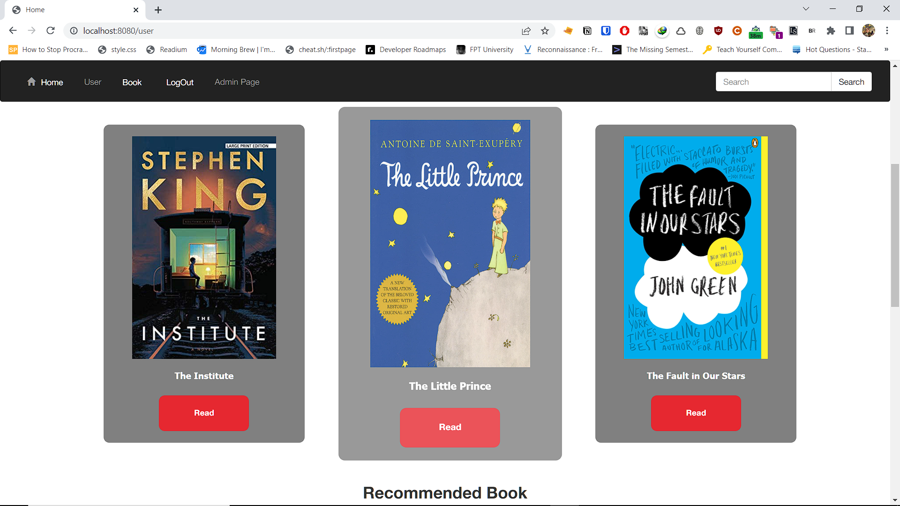
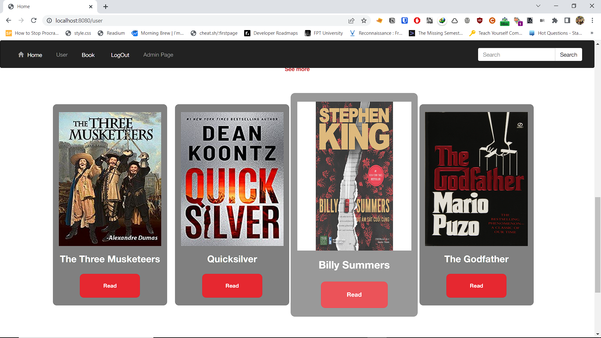
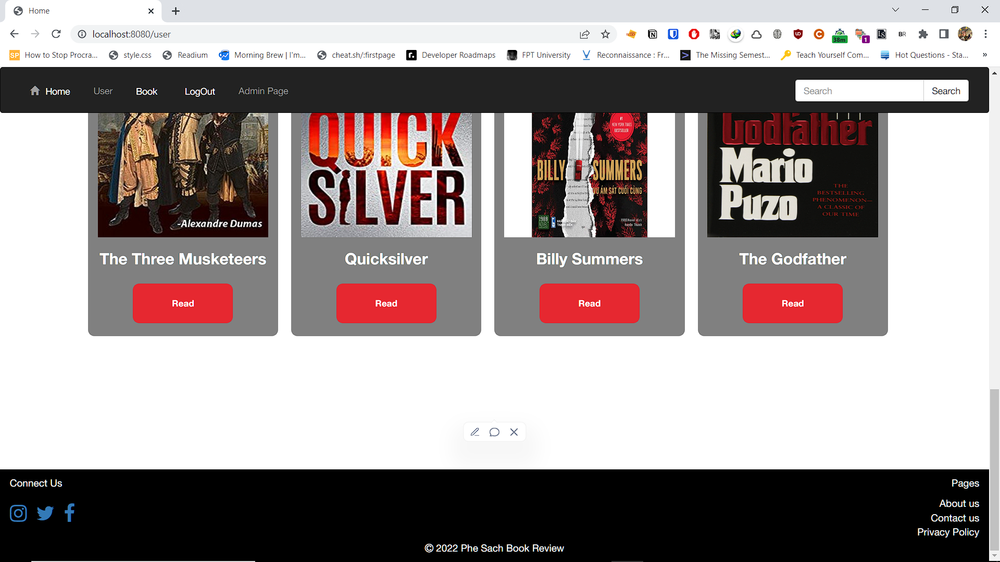
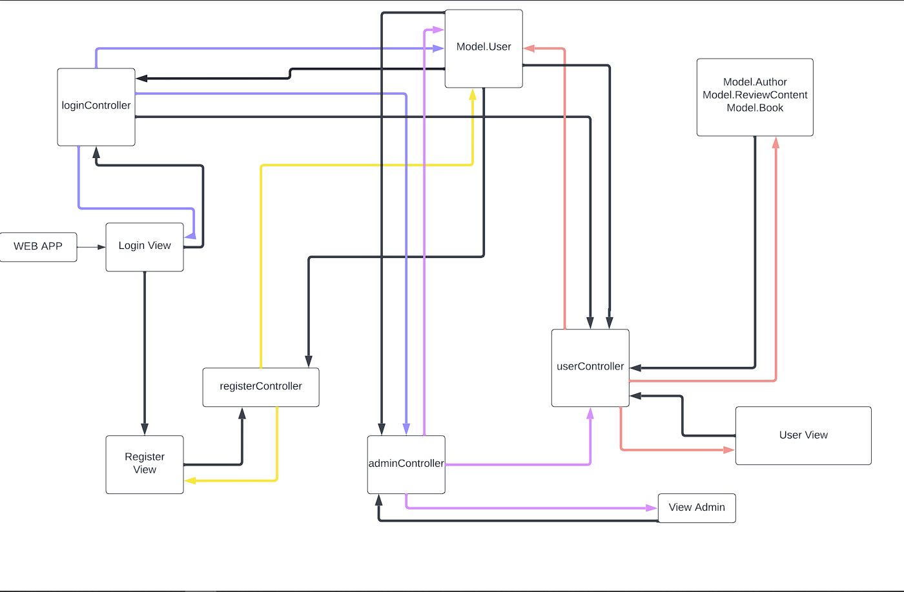

# A case study  
## System name  
Phê Sách Book Store  
## Background  
Each year there are approximately 4 million books published, either in print or digital. Thus, there are a lot of good books out there, but also bad books too.  

**How can we decide which book we would spend our time and money on?**   

That’s where the book critic sites come in, to act as an information source to help readers decide which book to buy and which to skip, and to let the reader themselves posting reviews about their own books for others to see.
## System purpose  
A website where people can post reviews about their own books as well as reading book reviews from other users. Additionally, people can choose to buy the books they like from the embedded link.
## Target demographic  
Everyone can access the website. Some content will be restricted to people above 18.
## System features  
### Users
- Account login 
- Search book by search bar
- Click to the direct link Amazon
### Admin

- Account login  
- Uploading book reviews  
- Review posts editing (only Admin)  
- Delete review posts (only Admin)  
- Edit book information (only Admin)  
- Book suggestion (from User to Admin)  
- Search book by search bar

## Wireframe/Screenshot 
### Login

### Register

### Home page  

### User Profile

### Book List

### Book Detail

### Admin Page

### Admin Edit Book Page

## Sitemap  

# Database design  

# System design  

## Description  

## New technologies learnt  
- Boostrap 4
- git/ Git Hub Desktop
## Coding convention  
We refered to this site [[https://www.geeksforgeeks.org/java-naming-conventions/]]
# Conclusion and Discussion  
## Pros  
- Can differentiate user and admin via login.
- Can relate many database tables together.
## Cons  
- Bad project planning leads to lack of features.
## Lesson Learnt
- The consequences of bad project planning.
- The consequences of bad team coordination.
- Gained experienced building a web app.
- How to resolve git conflict.
- Realize the benefit of brain dumping ideas.
